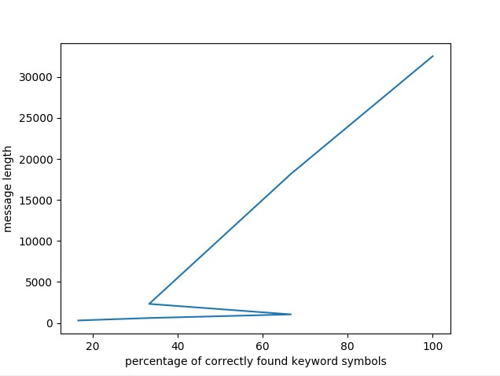
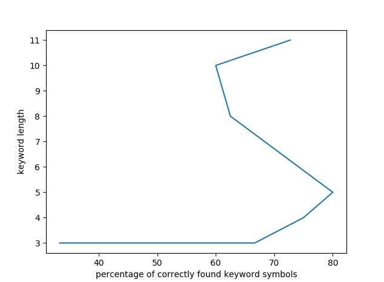

# Lab1. Cryptanalysis of simple substitution ciphers
## Report
_Suboch Polina, 2 group_

### Method results and analysis
#### Kasiski's method attack result depending on the length of the message
Message length | Expected keyword | Actual keyword | Key match correctness in percentages
--- | --- | --- |---
307 | EDITOR | AHJIQR | 17%
607 | EDITOR | WDDDCR | 33%
1049 | EDITOR | WDIHOR | 67%
2326 | EDITOR | EDIHMJ | 33%
18180 | EDITOR | EDIHOJ | 67%
32529 | EDITOR | EDITOR | 100%

#### Kasiski's method attack result depending on the length of the key
Message length | Expected keyword | Actual keyword | Key match correctness in percentages
--- | --- | --- |---
17860 | MAP | OAL | 33%
17860 | LOG | LMG | 67%
17860 | NODE | NMDE | 75%
17860 | KAFKA | KAFQA | 80%
17860 | DOCUMENT | DMCGMENH | 63%
17860 | COORDINATE | CMMRDINAHW | 60%
17860 | APPLICATION | ALLLICAHION | 73%

### Remarks

* In some executions the key length was not found correctly on the first try, for example, after increasing key length.
In such cases the parameters used in logic that filters garbage data (random matches of l-grammas) are changed manually 
according to the input data (message length, key length).
* Firstly in Vigenere cipher logic the method of frequency analysis was used to decrypt strings encrypted by Caesar
cipher (these strings are composed from symbols on exact position of a string encrypted with Vigenere cipher),
but it gave wrong results. Thus the other implementation of decryption is used. It is based on shifting the most
frequent symbol in a string to 'E' (as the most frequent symbol in English alphabet).